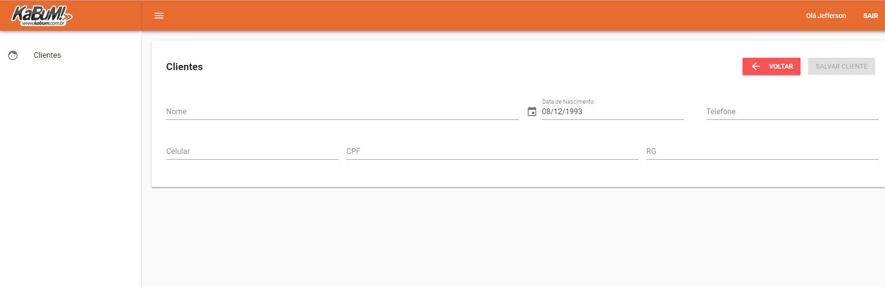

# Projeto KaBuM

### O que é ?

Um simples projeto desenvolvido para participação do processo selectivo do  **KaBuM Comércio Eletrônic!**.

### Especificações do Desafio

* Uma área administrativa onde o(s) usuário(s) devem acessar através de login e senha
* Criar um gerenciador de clientes (Listar, Incluir, Editar e Excluir)
* O cadastro do Cliente deve conter: Nome; Data Nascimento; CPF; RG; Telefone.
* O Cliente pode ter 1 ou N endereços.

### Configurções e Softwares necessários

Antes de mais nada, baixe e instale todos os programas a seguir:

* PHP >= 7.1.21
* NPM  >= 6.8.0
* MySQL >= 5.7.23

### Diretório remoto

Certifique-se de que você já tenha feito um clone do repositório. Caso não tenha feito, escolha um diretório de seu preferência e utilize o seguinte comando em seu terminal.

```bash
git clone https://github.com/JeffersonGibin/kabum-project.git
```

### Depêndencias package.json

Agora vamos baixar todas dependências que o projeto utiliza. Acesse o diretório do painel e digite:
```bash
npm install
```

O projeto utiliza vue.js e o source de seus arquivos estão em '.vue' para testar em ambiente local talvez seja necessário a instalação de vue.
```bash
npm install vue
```

### Restaurando banco de dados.

Certifique-se que o MySQL já esteja instalado em sua máquina e acesse o diretório da pasta **webservice** pelo terminal.
**kabum-project\webservice\src\script**.

Agora vamos restaurar a base de dados, primeiro crie um banco de dados chamado 'kabum'.

```bash 
mysql -uroot -p123

create database kabum charset=utf8;
exit;
```

Use o exemplo a seguir para restaurar a base de dados por linha de comando.
```bash
mysql -u${SEU USUÁRIO} -p${SUA SENHA} ${NOME DA BASE DE DADOS} < database.sql

#Algo como
mysql -uroot -p123 bancoDeDados > database.sql
```


### Webservice PHP

O Webservice é quem prove toda massa de dados necessárias para o painel administrativo funcionar. Nesse Projeto o webservice foi construido do zero, mais a frente dessa leitura você vai encontrar as rotas que ele disponibiliza.

Para que o webservice funcione é necessário copiar a pasta webservice dentro do diretório **htdocs** do seu servidor local.

### Configuração do WebService

Acesse o diretório kabum-project/webservice/config/src/settings/ e edite o arquivo config.php

```php
<?php

/*
 * Define se o ambiente é produção ou desenvolvimento.
 */
$environment = "DEV";

/*
 * Não esqueceça desse diretório.
 * Diretório raiz.
 */
$dirName = "kabum";

/*
 * Host da onde está o banco de dados.
 */
$host = "localhost";

/*
 * Nome do banco de dados.
 */
$dbname = "";

/*
 * Usuário do banco de dados.
 */
$user = "";

/*
 * Senha do banco de dados.
 */
$password = "";

```

### Front-end

Para testar localmente certifique-se de que tenha todos os programas necessários já instalado e que o servidor PHP com o webservice esteja funcionando. Execute o comando **npm run dev** para iniciar o projeto em localhost.

## Fotos do sistema


## Login


## Painel


## Listagem de clientes


## Cadastro de clientes





## Editar clientes


## Endereço clientes


## Documentação API

#### Token

Para gerar um token você precisa enviar login e senha para o endpoint de login. O token, id e nome do usuário são salvos no localStorage. Para recuperar utilize a função

```javascript
{
 // ao efetuar login você vai perceber que a sessão é salva com essa chave.
  localStorage.get("SESSION_KABUM")
}
```

Para cadastrar um usuário no sistema utilize a seguinte Query.

```sql
  INSERT INTO usuario (nome, login, senha, permissao) VALUES ('admin', 'admin', md5('123'), 'ADMIN');
```

#### HEADER
Em todas as rotas é necessário enviar o token(Authorization) no header da requisição exceto na rota **login**.
**Nota**: O token não expira;


| Parâmetros     | tipo       | Descrição                       |
| -------------  |------------|---------------------------------|
| Authorization  | String     | Token da sessão do usuário      |


#### Cliente

| Parâmetros     | tipo       | Descrição                                      |
| -------------  |------------|------------------------------------------------|
| nome           | String     | nome do cliente **(Required)**                 |
| ativo          | bigInt     | 0 / 1                                          |
| cpf            | String     | CPF do cliente                                 |
| rg             | String     | R.G do cliente                                 |
| dataNascimento | Date       | data de nascimento do cliente                  |
| telefone       | String     | Telefone do cliente do cliente                 |
| celular        | String     | Celular do cliente                             |
| usuarioid      | int        | usuário que cadastrou o cliente **(Required)** |

**Rotas de cliente**
*  Cadastrar POST - http://localhost/api/cadCliente/
*  Editar PUT - http://localhost/api/editCliente/[clienteID]
*  Remover PUT - http://localhost/api/removeCliente/[clienteID]
*  Listar GET - http://localhost/api/listaCliente/[clienteID]

#### Endereço Cliente


| Parâmetros     | tipo       | Descrição                                                    |
| -------------  |------------|---------------------------------------------------------     |
| ativo          | 0/1        | informa se o endereço está  ou não ativo       **(Required)**|
| endereco       | String     | nome do cliente **(Required)**                               |
| numero         | String     | Número                                                       |
| bairro         | String     | Bairro do endereço                                           | 
| cep            | String     | Cep do endereço do cliente                                   |
| clienteid      | int        | clienteid                                                    |
| estadoid       | int        | Estadoid                                                     |
| cidadeid       | int        | cidadeid                                                     |

**Rotas de endereço**
* Todos os campos da entidade ClienteEndereco pode ser passados exceto, clienteid;
* Cadastrar POST - http://localhost/api/cadEnderecoCliente/
* Editar  PUT - http://localhost/api/editCliente/[enderecoClienteEnderecoID]);
* Remover  PUT - http://localhost/api/removerClienteEndereco/[enderecoClienteEnderecoID]
* Listar  GET - http://localhost/api/listaClienteEndereco/[enderecoClienteID]


#### Retorno de Erros

| Status                      | Code | Message                                                  |
| ----------------------------|------|----------------------------------------------------------|
| ERRO                        | 500  | Você não está logado no sistema!                         |
| REQUIRED_VALUE              | 200  | Campos obrigatórios                                      |
| CLIENTE_EXISTS              | 200  | O cliente já está cadastrado!                            |
| CLIENTE_NOT_EXISTS          | 200  | O cliente que você está tentando editar não existe.      |
| CLIENTE_ENDERECO_NOT_EXISTS | 200  | O endereço que você está tentando editar não existe.     |
| NOT_FOUND                   | 200  | Retornado quando algo não foi encontrado                 |


## Como colocar em produção ?

1° - Altere o caminho da API acessando **painel/src/services/Services.js** e altere a constante *URL* com a url correta.

2 ° - Acesse o diretório raiz do painel e digite **npm run build**. O webpack e suas dependências iram empacotar todos os arquivos necessários, após terminar, todos os arquivos para exbir a página estarão separados no diretório **./dist**:


### Tecnologias utilizadas
* PHP
* MySQL
* Vue.js, Vuetify
* HTML, CSS

